# 🔥🔥 Wooble Social Media App  

Wooble is a fully functional social media app with multiple features built with flutter and dart.

Star⭐ the repo if you like what you see😉.

## ✨ Requirements

* Any Operating System (ie. MacOS X, Linux, Windows)
* Any IDE with Flutter SDK installed (ie. IntelliJ, Android Studio, VSCode etc)
* A little knowledge of Dart and Flutter
* A brain to think 

## Screenshots

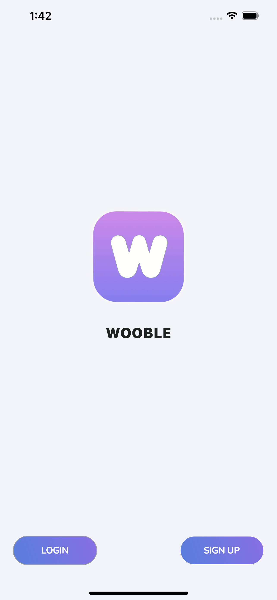 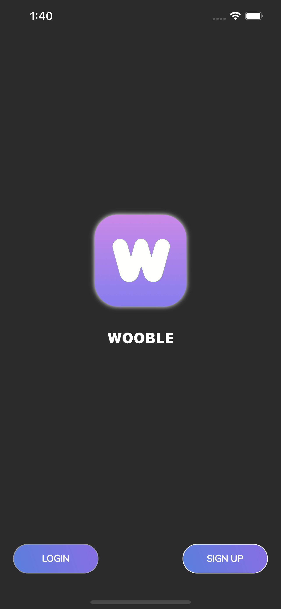
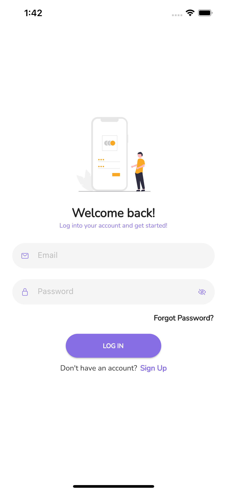 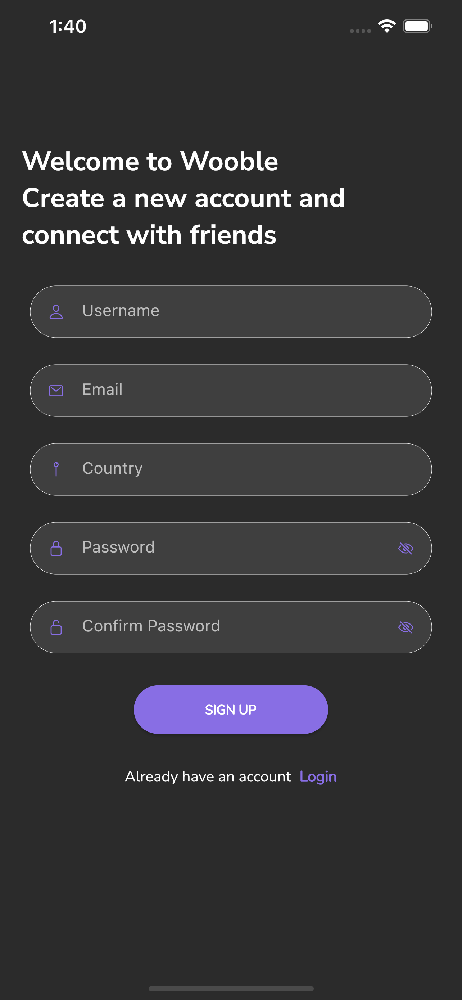
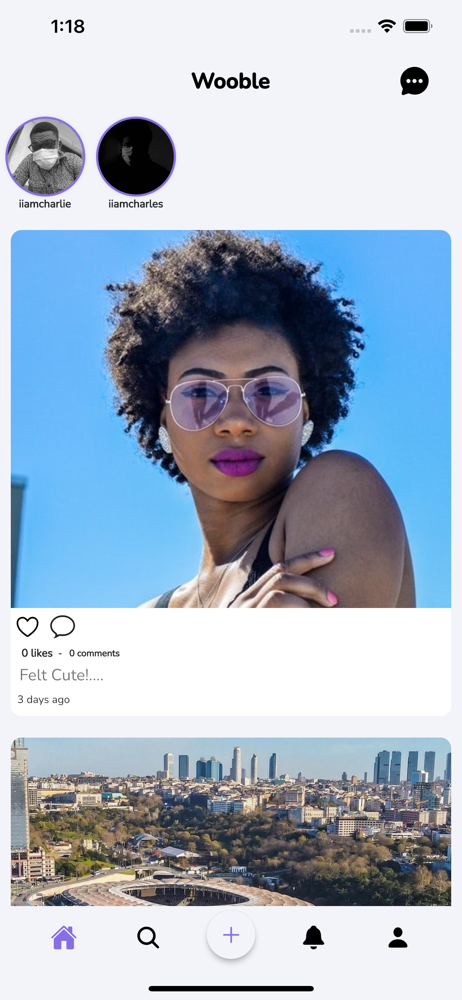 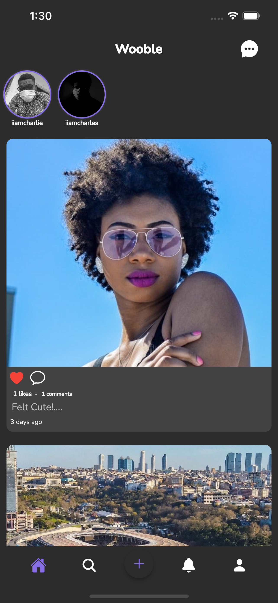
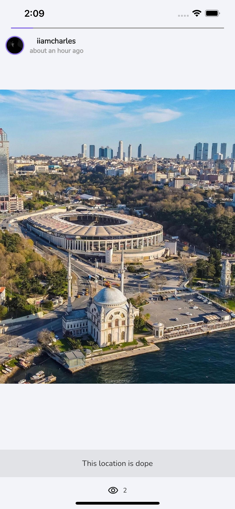 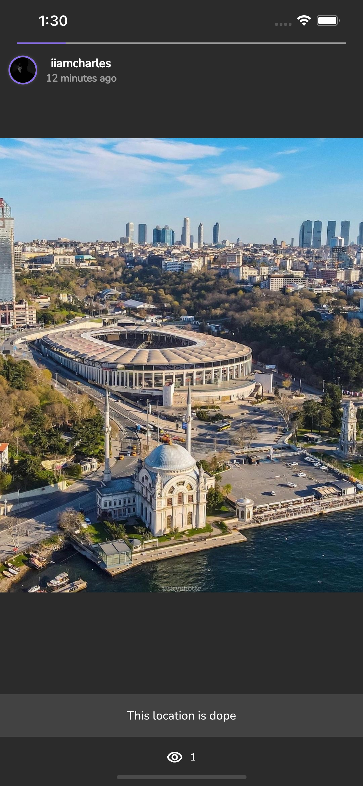
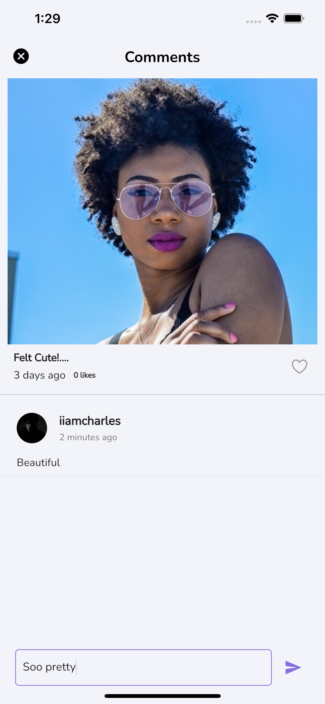 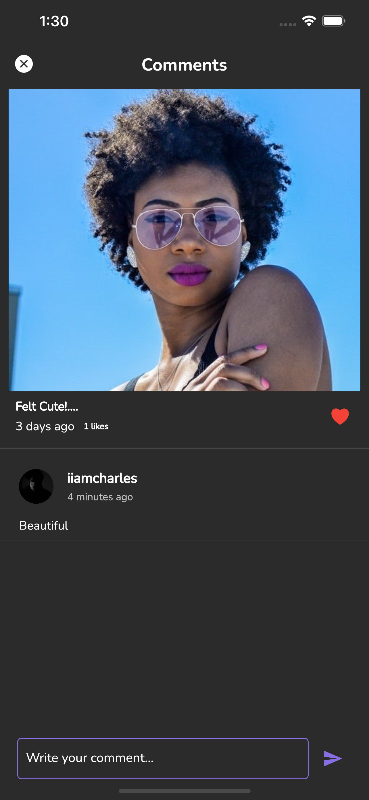
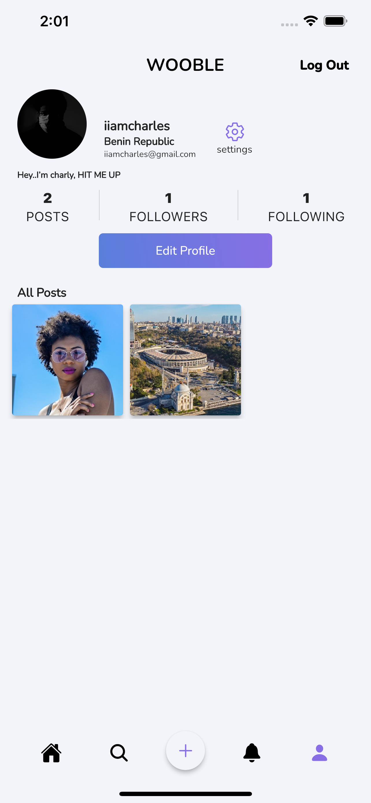 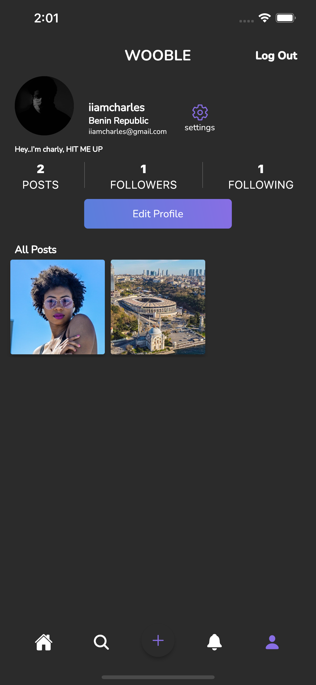
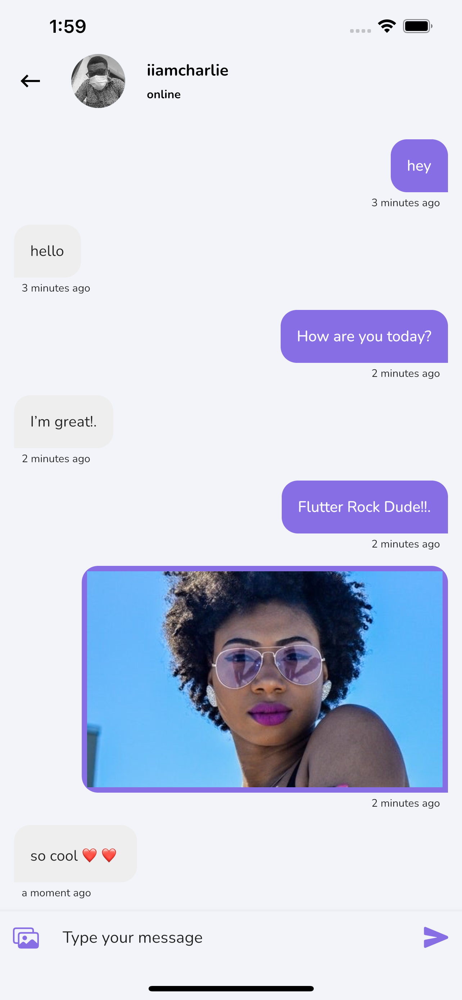 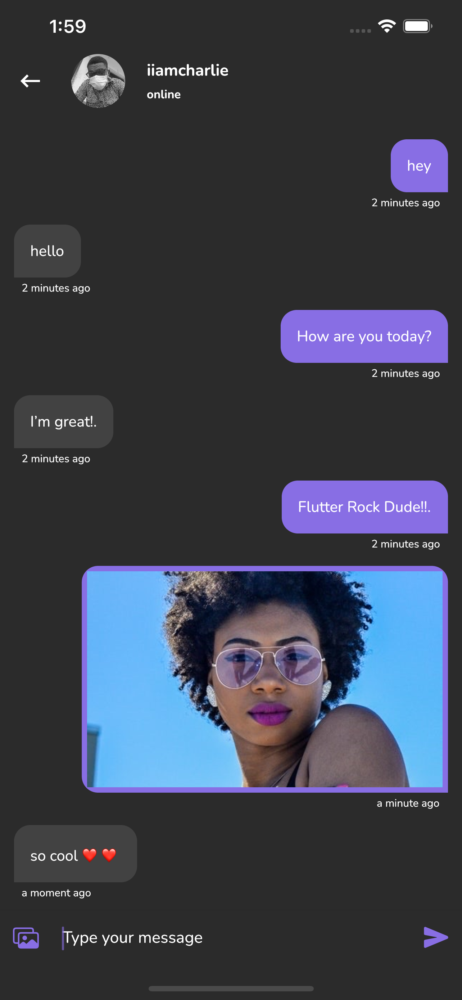
 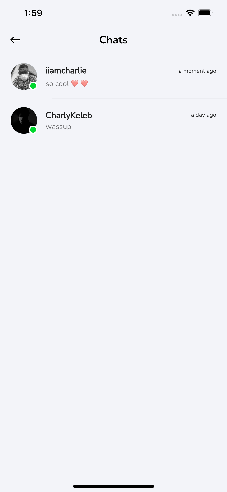
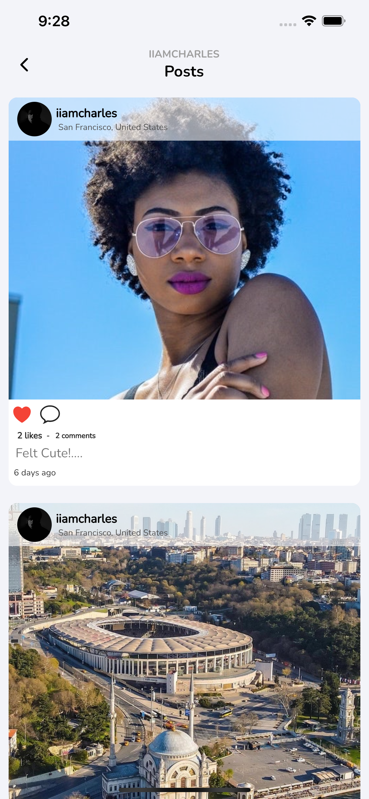 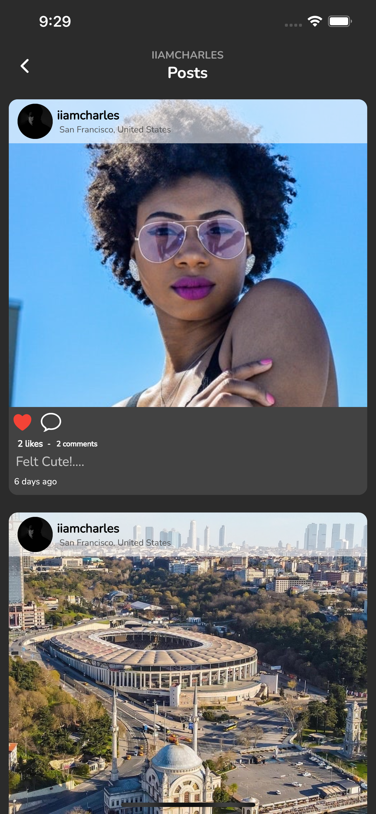

**Charly Keleb
CharlyKeleb** 
